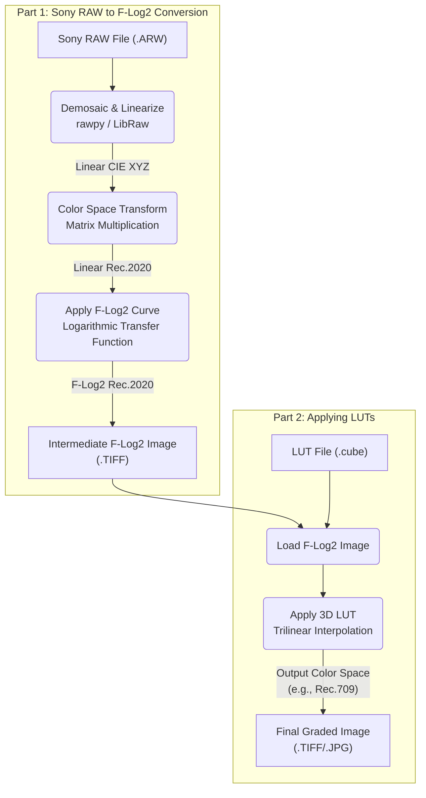

# AnyRAW to Fujifilm's LUTs

DISCLAIMER: Most of the code written in this repo is modified from answers by Gemini 3pro.

## 1. Overview of the workflow



## 2. Dependencies

The codebase is fully written in `python` with the help of the following packages:

- `rawpy`: get demosaiced image from camera's raw output
- `numpy`: apply point-wise LOG transform to image tensor
- `colour-science`: apply 3D-LUTs on images
- `imageio`: encode images to regular files (e.g. jpeg)

Currently, the script and its dependencies are running on CPU only. 
Future development will utilize `pytorch` or `jax` and their ability to auto-compile GPU code to accelerate the computation. 


## 3. Quick start

1. download LUTs from [Fujifilm's website](https://www.fujifilm-x.com/global/support/download/lut/)
2. extract and select your favourate LUTs that are applicable to F-Log2 format (both 33-point/65-point should be fine)
3. run the script with your RAW still image file and the path to all the LUTs
4. converted images will be saved as `jpeg` files in the current path with appended names

```bash
python ./convert_raw.py --image IMAGE --lut LUT
```
