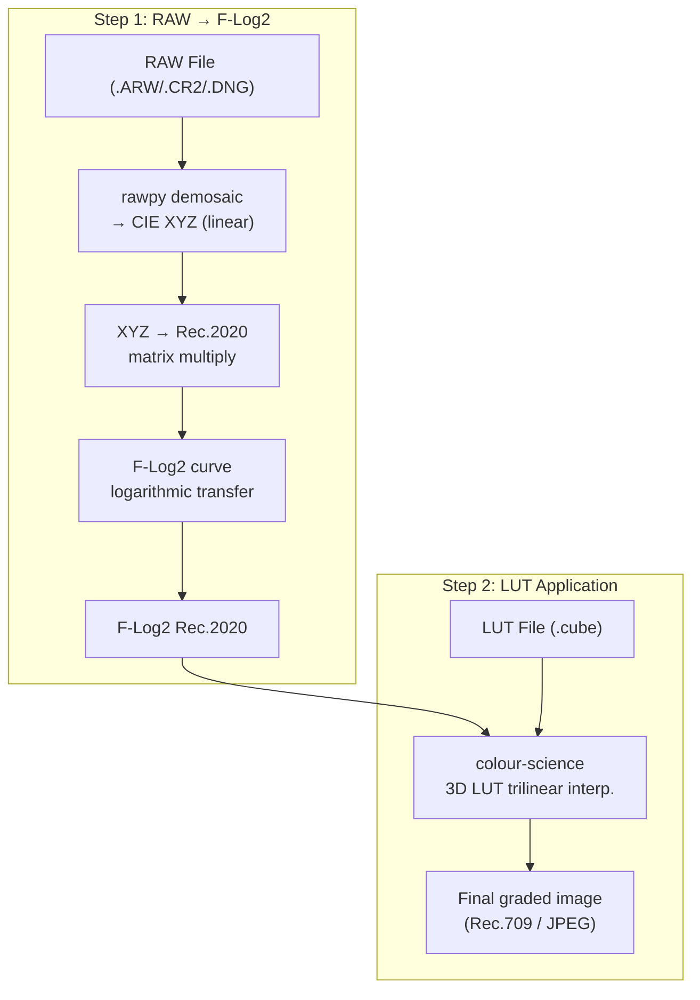

# AnyRAW to Fujifilm's LUTs


Convert Sony RAW files (and other camera formats) into Fujifilm F-Log2 images with Fujifilm 3D LUTs applied.

## Architecture

```
┌─────────────────────────────────────────────────────────────────┐
│  Electron Frontend (TypeScript)                                  │
│  ┌───────────────────────────────────────────────────────────┐  │
│  │  src/app.ts          — UI logic, state, dialogs           │  │
│  │  src/color.ts        — F-Log2 curve, XYZ→Rec2020 stubs   │  │
│  │  src/lut.ts          — WebGL2 LUT preview (stub)          │  │
│  │  src/types.d.ts      — ElectronAPI type definitions       │  │
│  └───────────────────────────────────────────────────────────┘  │
│                          ↕ preload IPC bridge                   │
│  ┌───────────────────────────────────────────────────────────┐  │
│  │  src/electron/                                             │  │
│  │  main.ts             — app lifecycle, subprocess manager   │  │
│  │  preload.ts          — secure contextBridge API surface    │  │
│  │  ipc.ts              — HTTP proxy to Python backend        │  │
│  └───────────────────────────────────────────────────────────┘  │
└─────────────────────────────────────────────────────────────────┘
                               ↕ HTTP (localhost:19876)
┌─────────────────────────────────────────────────────────────────┐
│  Python Backend (CPU-only, torch-free)                          │
│  ┌───────────────────────────────────────────────────────────┐  │
│  │  backend/pipeline.py   — load_raw, apply_flog2, apply_lut │  │
│  │  backend/cube_parser   — .cube 3D LUT parser              │  │
│  │  backend/raw_loader    — rawpy/tiff/jpeg → XYZ float32    │  │
│  │  backend/main.py       — FastAPI: POST /convert, /health  │  │
│  │  backend/models.py     — Pydantic request/response schemas│  │
│  └───────────────────────────────────────────────────────────┘  │
└─────────────────────────────────────────────────────────────────┘
```

### Data flow


```mermaid
graph TD
    subgraph "Step 1: RAW → F-Log2"
    A["RAW File (.ARW/.CR2/.DNG)"] --> B["rawpy demosaic<br>→ CIE XYZ (linear)"]
    B --> C["XYZ → Rec.2020<br>matrix multiply"]
    C --> D["F-Log2 curve<br>logarithmic transfer"]
    D --> E["F-Log2 Rec.2020"]
    end

    subgraph "Step 2: LUT Application"
    E --> F["colour-science<br>3D LUT trilinear interp."]
    G["LUT File (.cube)"] --> F
    F --> H["Final graded image<br>(Rec.709 / JPEG)"]
    end
```

## Dependencies

### Python backend (CPU-only, torch-free)

- `rawpy` — RAW demosaicing via LibRaw
- `numpy` — numerical transforms (XYZ→Rec.2020, F-Log2 curve)
- `colour-science` — 3D LUT application (trilinear interpolation)
- `imageio` — JPEG encoding
- `tifffile` — TIFF I/O
- `fastapi` + `uvicorn` — HTTP service on localhost:19876
- Python 3.11.x required

### Frontend (Electron + TypeScript)

- `electron` — desktop shell
- `electron-builder` — per-platform installers
- `typescript` + `esbuild` — multi-target compilation

## Quick Start

### 1. Command Line (standalone)

```bash
# Install Python deps
pip install -r backend/requirements.txt

# Download LUTs from Fujifilm
# https://www.fujifilm-x.com/global/support/download/lut/
# Select F-Log2 compatible LUTs (.cube format, 33-point or 65-point)

# Run conversion
python convert_raw.py -i photo.ARW -l /path/to/luts/
# → Outputs JPEG files with LUT name appended
```

### 2. Desktop GUI (Electron)

#### Prerequisites

- Node.js 18+
- Python 3.11.x with backend deps installed

#### First-time setup

```bash
# 1. Set up Python backend
cd backend
python3.11 -m venv venv
source venv/bin/activate        # Linux/macOS
pip install -r requirements.txt

# 2. Set up Electron frontend
cd ..
npm install
```

#### Development mode

```bash
npm run build          # Compile TypeScript (main + renderer)
npm run start          # Launch Electron (auto-spawns Python backend)
```

#### Build installers

```powershell
# 1. Prepare backend dependencies
mkdir build-resources
python -m venv build-resources/python-venv
.\build-resources\python-venv\Scripts\pip.exe install -r backend\requirements.txt

# 2. Package
npm run dist           # Produces:
                       #   - Windows: NSIS one-file .exe
                       #   - macOS: .dmg
                       #   - Linux: .AppImage
```

*Note: If you experience network timeouts while downloading Electron binaries, you can use a mirror:*
```powershell
$env:ELECTRON_MIRROR="https://npmmirror.com/mirrors/electron/"
$env:ELECTRON_BUILDER_BINARIES_MIRROR="https://npmmirror.com/mirrors/electron-builder-binaries/"
npm run dist
```

#### Using the GUI

1. Click **Open RAW Photo** — select your camera RAW file (.ARW, .CR2, .DNG, etc.)
2. Click **Select LUT Folder** — choose a folder containing .cube files
3. Click **Convert** — the backend processes the image with each LUT
4. Browse thumbnails — click any to preview at full size
5. Adjust **Exposure** slider to tweak exposure before re-converting
6. Click **Export Selected** — saves chosen images as JPEG

### 3. Testing

```bash
# Python backend tests (25 tests, 5 files)
cd backend && python -m pytest tests/ -v

# TypeScript type checking
npm run typecheck

# End-to-end UI tests (Playwright)
npm run test:e2e
```

## Project Structure

```
├── backend/                          # Python FastAPI backend (torch-free)
│   ├── __init__.py
│   ├── main.py                      # FastAPI app (port 19876)
│   ├── pipeline.py                  # Core pipeline functions
│   ├── cube_parser.py               # .cube LUT parser
│   ├── raw_loader.py                # Multi-format RAW/TIFF/JPEG loader
│   ├── models.py                    # Pydantic schemas
│   ├── requirements.txt             # torch-free deps, Python 3.11
│   └── tests/                       # 25 pytest tests
│
├── src/                              # Electron frontend (TypeScript)
│   ├── app.ts                       # UI logic, IPC calls
│   ├── color.ts                     # F-Log2, XYZ→Rec2020
│   ├── lut.ts                       # WebGL2 LUT preview
│   ├── types.d.ts                   # ElectronAPI interface
│   └── electron/
│       ├── main.ts                  # App lifecycle, subprocess
│       ├── preload.ts               # Secure IPC bridge
│       └── ipc.ts                   # HTTP proxy to backend
│
├── tests/e2e/                        # Playwright UI tests (9 tests)
├── .github/workflows/build.yml       # CI: lint, test, build, e2e
├── electron-builder.yml              # Packaging config
├── convert_raw.py                    # CLI entry point (standalone)
├── convert_raw_torch.py              # GPU variant (reference only)
└── raw_converter_gui.py              # PyQt5 GUI (reference only)
```

## Packaging

Per-platform single-file installers via electron-builder:

| Platform | Format | Notes |
|---|---|---|
| Windows | NSIS one-file `.exe` | `nsis.oneFile: true` |
| macOS | `.dmg` | Intel + Apple Silicon |
| Linux | `.AppImage` | Portable, no install required |

Each installer bundles the Electron app and the Python backend (with dependencies pre-installed). No separate Python installation required.

## GPU Acceleration (reference)

`convert_raw_torch.py` provides a PyTorch-based GPU path for reference. The packaged app uses the CPU-only NumPy path by default for broader compatibility and simpler packaging. GPU acceleration can be added back as an optional dependency in a future release.

## License

[MIT](./LICENSE)
